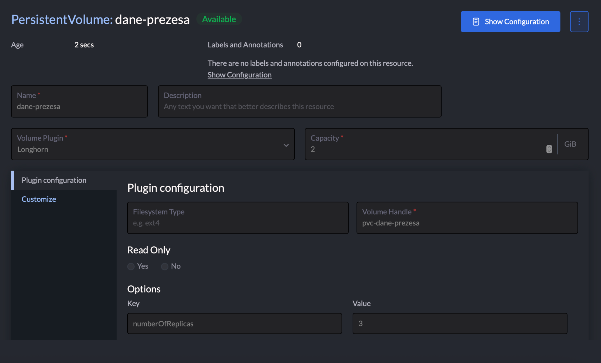
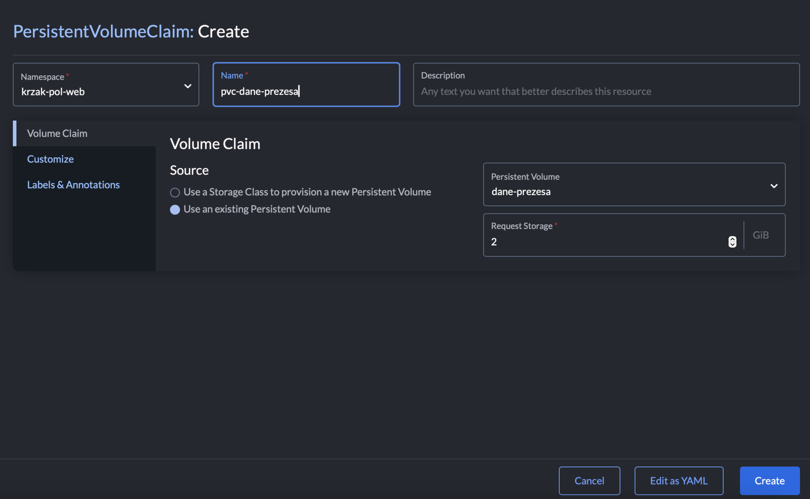

1. Zainstalowałem charta longhorna z defaultowymi ustawieniami.
2. Namespace `krzak-pol-magazyn` nie istniał, więc go stworzyłem. Potem dodałem pv i pvc:





3. oraz w końcu dodałem deployment:

```yaml
apiVersion: apps/v1
kind: Deployment
metadata:
  annotations:
    deployment.kubernetes.io/revision: '1'
  creationTimestamp: '2026-04-10T09:11:36Z'
  generation: 1
  labels:
    workload.user.cattle.io/workloadselector: apps.deployment-krzak-pol-web-dep-dane-prezesa
  managedFields:
    - apiVersion: apps/v1
      fieldsType: FieldsV1
      fieldsV1:
        f:metadata:
          f:labels:
            .: {}
            f:workload.user.cattle.io/workloadselector: {}
        f:spec:
          f:progressDeadlineSeconds: {}
          f:replicas: {}
          f:revisionHistoryLimit: {}
          f:selector: {}
          f:strategy:
            f:rollingUpdate:
              .: {}
              f:maxSurge: {}
              f:maxUnavailable: {}
            f:type: {}
          f:template:
            f:metadata:
              f:labels:
                .: {}
                f:workload.user.cattle.io/workloadselector: {}
              f:namespace: {}
            f:spec:
              f:affinity: {}
              f:containers:
                k:{"name":"container-0"}:
                  .: {}
                  f:args: {}
                  f:command: {}
                  f:image: {}
                  f:imagePullPolicy: {}
                  f:name: {}
                  f:resources: {}
                  f:securityContext:
                    .: {}
                    f:allowPrivilegeEscalation: {}
                    f:privileged: {}
                    f:readOnlyRootFilesystem: {}
                    f:runAsNonRoot: {}
                  f:terminationMessagePath: {}
                  f:terminationMessagePolicy: {}
                  f:volumeMounts:
                    .: {}
                    k:{"mountPath":"/dane_prezesa"}:
                      .: {}
                      f:mountPath: {}
                      f:name: {}
                  f:workingDir: {}
              f:dnsPolicy: {}
              f:restartPolicy: {}
              f:schedulerName: {}
              f:securityContext: {}
              f:terminationGracePeriodSeconds: {}
              f:volumes:
                .: {}
                k:{"name":"vol-auexa"}:
                  .: {}
                  f:name: {}
                  f:persistentVolumeClaim:
                    .: {}
                    f:claimName: {}
      manager: agent
      operation: Update
      time: '2026-04-10T09:11:36Z'
    - apiVersion: apps/v1
      fieldsType: FieldsV1
      fieldsV1:
        f:metadata:
          f:annotations:
            .: {}
            f:deployment.kubernetes.io/revision: {}
        f:status:
          f:conditions:
            .: {}
            k:{"type":"Available"}:
              .: {}
              f:lastTransitionTime: {}
              f:lastUpdateTime: {}
              f:message: {}
              f:reason: {}
              f:status: {}
              f:type: {}
            k:{"type":"Progressing"}:
              .: {}
              f:lastTransitionTime: {}
              f:lastUpdateTime: {}
              f:message: {}
              f:reason: {}
              f:status: {}
              f:type: {}
          f:observedGeneration: {}
          f:replicas: {}
          f:unavailableReplicas: {}
          f:updatedReplicas: {}
      manager: k3s
      operation: Update
      subresource: status
      time: '2026-04-10T09:11:36Z'
  name: dep-dane-prezesa
  namespace: krzak-pol-web
  resourceVersion: '205982'
  uid: 76be771b-d755-4941-9f30-9bafbeabb8fe
spec:
  progressDeadlineSeconds: 600
  replicas: 1
  revisionHistoryLimit: 10
  selector:
    matchLabels:
      workload.user.cattle.io/workloadselector: apps.deployment-krzak-pol-web-dep-dane-prezesa
  strategy:
    rollingUpdate:
      maxSurge: 25%
      maxUnavailable: 25%
    type: RollingUpdate
  template:
    metadata:
      labels:
        workload.user.cattle.io/workloadselector: apps.deployment-krzak-pol-web-dep-dane-prezesa
      namespace: krzak-pol-web
    spec:
      affinity: {}
      containers:
        - args:
            - '2147483647'
          command:
            - /bin/sleep
          image: busybox:latest
          imagePullPolicy: Always
          name: container-0
          resources: {}
          securityContext:
            allowPrivilegeEscalation: false
            privileged: false
            readOnlyRootFilesystem: false
            runAsNonRoot: false
          terminationMessagePath: /dev/termination-log
          terminationMessagePolicy: File
          volumeMounts:
            - mountPath: /dane_prezesa
              name: vol-auexa
          workingDir: /
      dnsPolicy: ClusterFirst
      restartPolicy: Always
      schedulerName: default-scheduler
      securityContext: {}
      terminationGracePeriodSeconds: 30
      volumes:
        - name: vol-auexa
          persistentVolumeClaim:
            claimName: pvc-dane-prezesa
status:
  conditions:
    - lastTransitionTime: '2026-04-10T09:11:36Z'
      lastUpdateTime: '2026-04-10T09:11:36Z'
      message: Deployment does not have minimum availability.
      reason: MinimumReplicasUnavailable
      status: 'False'
      type: Available
    - lastTransitionTime: '2026-04-10T09:11:36Z'
      lastUpdateTime: '2026-04-10T09:11:36Z'
      message: ReplicaSet "dep-dane-prezesa-5974598cd6" is progressing.
      reason: ReplicaSetUpdated
      status: 'True'
      type: Progressing
  observedGeneration: 1
  replicas: 1
  unavailableReplicas: 1
  updatedReplicas: 1
```
