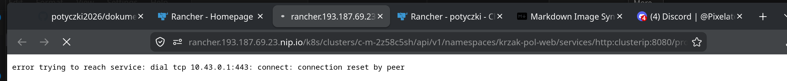
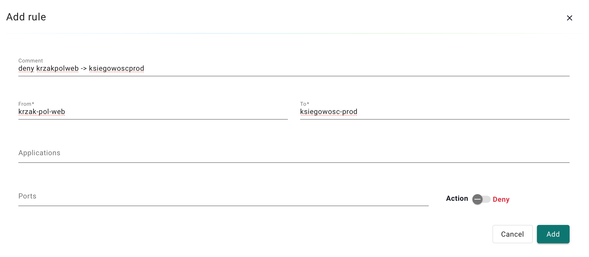

1. Módlmy się, zeby to nie wychuchło (właśnie zauwazyłem, ze mi z z kropką z jakiegoś powodu nie działa xd).

2. Dodałem 2 grupy w nv:
 - `krzak-pol-web` - `namespace=krzak-pol-web`
 - `ksiegowosc-prod` - `namespace=ksiegowosc-prod`

i finalnie dodałem i zapplyowałem network rule'a:

