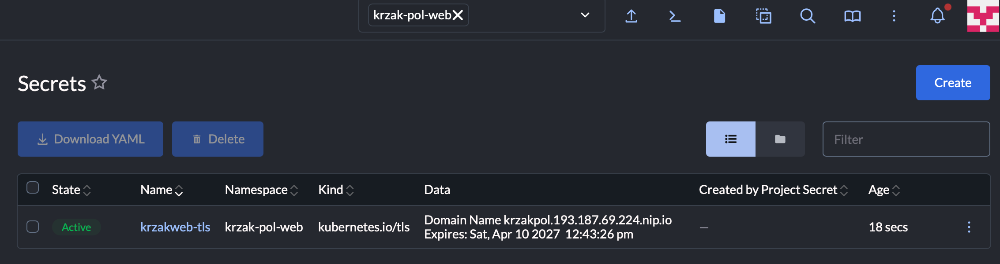

1-2: oto nowy deployment z legendarną wizytówką:

```yaml
apiVersion: apps/v1
kind: Deployment
metadata:
  name: nginx
  annotations:
    deployment.kubernetes.io/revision: '8'
    #  key: string
  creationTimestamp: '2026-04-10T08:49:12Z'
  generation: 9
  labels:
    workload.user.cattle.io/workloadselector: apps.deployment-krzak-pol-web-nginx
    #  key: string
  namespace: krzak-pol-web
  resourceVersion: '225185'
  uid: c3c15b40-a8fa-43cd-b2fd-902bbc63f659
  fields:
    - nginx
    - 5/5
    - 5
    - 5
    - 109m
    - container-0
    - nginx:alpine
    - workload.user.cattle.io/workloadselector=apps.deployment-krzak-pol-web-nginx
spec:
  selector:
    matchLabels:
      workload.user.cattle.io/workloadselector: apps.deployment-krzak-pol-web-nginx
      #  key: string
#    matchExpressions:
#      - key: string
#        operator: string
#        values:
#          - string
  template:
    metadata:
      labels:
        app: krzak-nginx
        workload.user.cattle.io/workloadselector: apps.deployment-krzak-pol-web-nginx
        #  key: string
      annotations:
        cattle.io/timestamp: '2026-04-10T10:35:41Z'
        #  key: string
      namespace: krzak-pol-web
#      creationTimestamp: string
#      deletionGracePeriodSeconds: int
#      deletionTimestamp: string
#      finalizers:
#        - string
#      generateName: string
#      generation: int
#      managedFields:
#        - apiVersion: string
#          fieldsType: string
#          fieldsV1:  key: string
#          manager: string
#          operation: string
#          subresource: string
#          time: string
#      name: string
#      ownerReferences:
#        - apiVersion: string
#          blockOwnerDeletion: boolean
#          controller: boolean
#          kind: string
#          name: string
#          uid: string
#      resourceVersion: string
#      selfLink: string
#      uid: string
    spec:
      containers:
        - image: nginx:alpine
          imagePullPolicy: Always
          name: container-0
          securityContext:
            allowPrivilegeEscalation: false
            privileged: false
            readOnlyRootFilesystem: false
            runAsNonRoot: false
          terminationMessagePath: /dev/termination-log
          terminationMessagePolicy: File
          volumeMounts:
            - mountPath: /usr/share/nginx/html
              name: vol-5aayo
          _init: false
          __active: true
          resources: {}
#        - args:
#            - string
#          command:
#            - string
#          env:
#            - name: string
#              value: string
#              valueFrom:
#                configMapKeyRef:
#                  key: string
#                  name: string
#                  optional: boolean
#                fieldRef:
#                  apiVersion: string
#                  fieldPath: string
#                fileKeyRef:
#                  key: string
#                  optional: boolean
#                  path: string
#                  volumeName: string
#                resourceFieldRef:
#                  containerName: string
#                  divisor: string
#                  resource: string
#                secretKeyRef:
#                  key: string
#                  name: string
#                  optional: boolean
#          envFrom:
#            - configMapRef:
#                name: string
#                optional: boolean
#              prefix: string
#              secretRef:
#                name: string
#                optional: boolean
#          image: string
#          imagePullPolicy: string
#          lifecycle:
#            postStart:
#              exec:
#                command:
#                  - string
#              httpGet:
#                host: string
#                httpHeaders:
#                  - name: string
#                    value: string
#                path: string
#                port: string
#                scheme: string
#              sleep:
#                seconds: int
#              tcpSocket:
#                host: string
#                port: string
#            preStop:
#              exec:
#                command:
#                  - string
#              httpGet:
#                host: string
#                httpHeaders:
#                  - name: string
#                    value: string
#                path: string
#                port: string
#                scheme: string
#              sleep:
#                seconds: int
#              tcpSocket:
#                host: string
#                port: string
#            stopSignal: string
#          livenessProbe:
#            exec:
#              command:
#                - string
#            failureThreshold: int
#            grpc:
#              port: int
#              service: string
#            httpGet:
#              host: string
#              httpHeaders:
#                - name: string
#                  value: string
#              path: string
#              port: string
#              scheme: string
#            initialDelaySeconds: int
#            periodSeconds: int
#            successThreshold: int
#            tcpSocket:
#              host: string
#              port: string
#            terminationGracePeriodSeconds: int
#            timeoutSeconds: int
#          name: string
#          ports:
#            - containerPort: int
#              hostIP: string
#              hostPort: int
#              name: string
#              protocol: string
#          readinessProbe:
#            exec:
#              command:
#                - string
#            failureThreshold: int
#            grpc:
#              port: int
#              service: string
#            httpGet:
#              host: string
#              httpHeaders:
#                - name: string
#                  value: string
#              path: string
#              port: string
#              scheme: string
#            initialDelaySeconds: int
#            periodSeconds: int
#            successThreshold: int
#            tcpSocket:
#              host: string
#              port: string
#            terminationGracePeriodSeconds: int
#            timeoutSeconds: int
#          resizePolicy:
#            - resourceName: string
#              restartPolicy: string
#          resources:
#            claims:
#              - name: string
#                request: string
#            limits:  key: string
#            requests:  key: string
#          restartPolicy: string
#          restartPolicyRules:
#            - action: string
#              exitCodes:
#                operator: string
#                values:
#                  - int
#          securityContext:
#            allowPrivilegeEscalation: boolean
#            appArmorProfile:
#              localhostProfile: string
#              type: string
#            capabilities:
#              add:
#                - string
#              drop:
#                - string
#            privileged: boolean
#            procMount: string
#            readOnlyRootFilesystem: boolean
#            runAsGroup: int
#            runAsNonRoot: boolean
#            runAsUser: int
#            seLinuxOptions:
#              level: string
#              role: string
#              type: string
#              user: string
#            seccompProfile:
#              localhostProfile: string
#              type: string
#            windowsOptions:
#              gmsaCredentialSpec: string
#              gmsaCredentialSpecName: string
#              hostProcess: boolean
#              runAsUserName: string
#          startupProbe:
#            exec:
#              command:
#                - string
#            failureThreshold: int
#            grpc:
#              port: int
#              service: string
#            httpGet:
#              host: string
#              httpHeaders:
#                - name: string
#                  value: string
#              path: string
#              port: string
#              scheme: string
#            initialDelaySeconds: int
#            periodSeconds: int
#            successThreshold: int
#            tcpSocket:
#              host: string
#              port: string
#            terminationGracePeriodSeconds: int
#            timeoutSeconds: int
#          stdin: boolean
#          stdinOnce: boolean
#          terminationMessagePath: string
#          terminationMessagePolicy: string
#          tty: boolean
#          volumeDevices:
#            - devicePath: string
#              name: string
#          volumeMounts:
#            - mountPath: string
#              mountPropagation: string
#              name: string
#              readOnly: boolean
#              recursiveReadOnly: string
#              subPath: string
#              subPathExpr: string
#          workingDir: string
      dnsPolicy: ClusterFirst
      imagePullSecrets:
#        - name: string
      initContainers:
        - args:
            - '-L'
            - >-
              https://raw.githubusercontent.com/atvalerie/zespol9-potyczki2026/refs/heads/main/assets/index.html
            - '-o'
            - /dupa/index.html
          image: alpine/curl:8.17.0
          imagePullPolicy: Always
          name: container-1
          securityContext:
            allowPrivilegeEscalation: false
            privileged: false
            readOnlyRootFilesystem: false
            runAsNonRoot: false
          terminationMessagePath: /dev/termination-log
          terminationMessagePolicy: File
          volumeMounts:
            - mountPath: /dupa
              name: vol-5aayo
          _init: true
          resources: {}
#        - args:
#            - string
#          command:
#            - string
#          env:
#            - name: string
#              value: string
#              valueFrom:
#                configMapKeyRef:
#                  key: string
#                  name: string
#                  optional: boolean
#                fieldRef:
#                  apiVersion: string
#                  fieldPath: string
#                fileKeyRef:
#                  key: string
#                  optional: boolean
#                  path: string
#                  volumeName: string
#                resourceFieldRef:
#                  containerName: string
#                  divisor: string
#                  resource: string
#                secretKeyRef:
#                  key: string
#                  name: string
#                  optional: boolean
#          envFrom:
#            - configMapRef:
#                name: string
#                optional: boolean
#              prefix: string
#              secretRef:
#                name: string
#                optional: boolean
#          image: string
#          imagePullPolicy: string
#          lifecycle:
#            postStart:
#              exec:
#                command:
#                  - string
#              httpGet:
#                host: string
#                httpHeaders:
#                  - name: string
#                    value: string
#                path: string
#                port: string
#                scheme: string
#              sleep:
#                seconds: int
#              tcpSocket:
#                host: string
#                port: string
#            preStop:
#              exec:
#                command:
#                  - string
#              httpGet:
#                host: string
#                httpHeaders:
#                  - name: string
#                    value: string
#                path: string
#                port: string
#                scheme: string
#              sleep:
#                seconds: int
#              tcpSocket:
#                host: string
#                port: string
#            stopSignal: string
#          livenessProbe:
#            exec:
#              command:
#                - string
#            failureThreshold: int
#            grpc:
#              port: int
#              service: string
#            httpGet:
#              host: string
#              httpHeaders:
#                - name: string
#                  value: string
#              path: string
#              port: string
#              scheme: string
#            initialDelaySeconds: int
#            periodSeconds: int
#            successThreshold: int
#            tcpSocket:
#              host: string
#              port: string
#            terminationGracePeriodSeconds: int
#            timeoutSeconds: int
#          name: string
#          ports:
#            - containerPort: int
#              hostIP: string
#              hostPort: int
#              name: string
#              protocol: string
#          readinessProbe:
#            exec:
#              command:
#                - string
#            failureThreshold: int
#            grpc:
#              port: int
#              service: string
#            httpGet:
#              host: string
#              httpHeaders:
#                - name: string
#                  value: string
#              path: string
#              port: string
#              scheme: string
#            initialDelaySeconds: int
#            periodSeconds: int
#            successThreshold: int
#            tcpSocket:
#              host: string
#              port: string
#            terminationGracePeriodSeconds: int
#            timeoutSeconds: int
#          resizePolicy:
#            - resourceName: string
#              restartPolicy: string
#          resources:
#            claims:
#              - name: string
#                request: string
#            limits:  key: string
#            requests:  key: string
#          restartPolicy: string
#          restartPolicyRules:
#            - action: string
#              exitCodes:
#                operator: string
#                values:
#                  - int
#          securityContext:
#            allowPrivilegeEscalation: boolean
#            appArmorProfile:
#              localhostProfile: string
#              type: string
#            capabilities:
#              add:
#                - string
#              drop:
#                - string
#            privileged: boolean
#            procMount: string
#            readOnlyRootFilesystem: boolean
#            runAsGroup: int
#            runAsNonRoot: boolean
#            runAsUser: int
#            seLinuxOptions:
#              level: string
#              role: string
#              type: string
#              user: string
#            seccompProfile:
#              localhostProfile: string
#              type: string
#            windowsOptions:
#              gmsaCredentialSpec: string
#              gmsaCredentialSpecName: string
#              hostProcess: boolean
#              runAsUserName: string
#          startupProbe:
#            exec:
#              command:
#                - string
#            failureThreshold: int
#            grpc:
#              port: int
#              service: string
#            httpGet:
#              host: string
#              httpHeaders:
#                - name: string
#                  value: string
#              path: string
#              port: string
#              scheme: string
#            initialDelaySeconds: int
#            periodSeconds: int
#            successThreshold: int
#            tcpSocket:
#              host: string
#              port: string
#            terminationGracePeriodSeconds: int
#            timeoutSeconds: int
#          stdin: boolean
#          stdinOnce: boolean
#          terminationMessagePath: string
#          terminationMessagePolicy: string
#          tty: boolean
#          volumeDevices:
#            - devicePath: string
#              name: string
#          volumeMounts:
#            - mountPath: string
#              mountPropagation: string
#              name: string
#              readOnly: boolean
#              recursiveReadOnly: string
#              subPath: string
#              subPathExpr: string
#          workingDir: string
      restartPolicy: Always
      schedulerName: default-scheduler
      serviceAccount: default
      serviceAccountName: default
      terminationGracePeriodSeconds: 30
      volumes:
        - emptyDir:
            sizeLimit: 100Mi
          name: vol-5aayo
#        - awsElasticBlockStore:
#            fsType: string
#            partition: int
#            readOnly: boolean
#            volumeID: string
#          azureDisk:
#            cachingMode: string
#            diskName: string
#            diskURI: string
#            fsType: string
#            kind: string
#            readOnly: boolean
#          azureFile:
#            readOnly: boolean
#            secretName: string
#            shareName: string
#          cephfs:
#            monitors:
#              - string
#            path: string
#            readOnly: boolean
#            secretFile: string
#            secretRef:
#              name: string
#            user: string
#          cinder:
#            fsType: string
#            readOnly: boolean
#            secretRef:
#              name: string
#            volumeID: string
#          configMap:
#            defaultMode: int
#            items:
#              - key: string
#                mode: int
#                path: string
#            name: string
#            optional: boolean
#          csi:
#            driver: string
#            fsType: string
#            nodePublishSecretRef:
#              name: string
#            readOnly: boolean
#            volumeAttributes:  key: string
#          downwardAPI:
#            defaultMode: int
#            items:
#              - fieldRef:
#                  apiVersion: string
#                  fieldPath: string
#                mode: int
#                path: string
#                resourceFieldRef:
#                  containerName: string
#                  divisor: string
#                  resource: string
#          emptyDir:
#            medium: string
#            sizeLimit: string
#          ephemeral:
#            volumeClaimTemplate:
#              metadata:
#                annotations:  key: string
#                creationTimestamp: string
#                deletionGracePeriodSeconds: int
#                deletionTimestamp: string
#                finalizers:
#                  - string
#                generateName: string
#                generation: int
#                labels:  key: string
#                managedFields:
#                  - apiVersion: string
#                    fieldsType: string
#                    fieldsV1:  key: string
#                    manager: string
#                    operation: string
#                    subresource: string
#                    time: string
#                name: string
#                namespace: string
#                ownerReferences:
#                  - apiVersion: string
#                    blockOwnerDeletion: boolean
#                    controller: boolean
#                    kind: string
#                    name: string
#                    uid: string
#                resourceVersion: string
#                selfLink: string
#                uid: string
#              spec:
#                accessModes:
#                  - string
#                dataSource:
#                  apiGroup: string
#                  kind: string
#                  name: string
#                dataSourceRef:
#                  apiGroup: string
#                  kind: string
#                  name: string
#                  namespace: string
#                resources:
#                  limits:  key: string
#                  requests:  key: string
#                selector:
#                  matchExpressions:
#                    - key: string
#                      operator: string
#                      values:
#                        - string
#                  matchLabels:  key: string
#                storageClassName: string
#                volumeAttributesClassName: string
#                volumeMode: string
#                volumeName: string
#          fc:
#            fsType: string
#            lun: int
#            readOnly: boolean
#            targetWWNs:
#              - string
#            wwids:
#              - string
#          flexVolume:
#            driver: string
#            fsType: string
#            options:  key: string
#            readOnly: boolean
#            secretRef:
#              name: string
#          flocker:
#            datasetName: string
#            datasetUUID: string
#          gcePersistentDisk:
#            fsType: string
#            partition: int
#            pdName: string
#            readOnly: boolean
#          gitRepo:
#            directory: string
#            repository: string
#            revision: string
#          glusterfs:
#            endpoints: string
#            path: string
#            readOnly: boolean
#          hostPath:
#            path: string
#            type: string
#          image:
#            pullPolicy: string
#            reference: string
#          iscsi:
#            chapAuthDiscovery: boolean
#            chapAuthSession: boolean
#            fsType: string
#            initiatorName: string
#            iqn: string
#            iscsiInterface: string
#            lun: int
#            portals:
#              - string
#            readOnly: boolean
#            secretRef:
#              name: string
#            targetPortal: string
#          name: string
#          nfs:
#            path: string
#            readOnly: boolean
#            server: string
#          persistentVolumeClaim:
#            claimName: string
#            readOnly: boolean
#          photonPersistentDisk:
#            fsType: string
#            pdID: string
#          portworxVolume:
#            fsType: string
#            readOnly: boolean
#            volumeID: string
#          projected:
#            defaultMode: int
#            sources:
#              - clusterTrustBundle:
#                  labelSelector:
#                    matchExpressions:
#                      - key: string
#                        operator: string
#                        values:
#                          - string
#                    matchLabels:  key: string
#                  name: string
#                  optional: boolean
#                  path: string
#                  signerName: string
#                configMap:
#                  items:
#                    - key: string
#                      mode: int
#                      path: string
#                  name: string
#                  optional: boolean
#                downwardAPI:
#                  items:
#                    - fieldRef:
#                        apiVersion: string
#                        fieldPath: string
#                      mode: int
#                      path: string
#                      resourceFieldRef:
#                        containerName: string
#                        divisor: string
#                        resource: string
#                podCertificate:
#                  certificateChainPath: string
#                  credentialBundlePath: string
#                  keyPath: string
#                  keyType: string
#                  maxExpirationSeconds: int
#                  signerName: string
#                secret:
#                  items:
#                    - key: string
#                      mode: int
#                      path: string
#                  name: string
#                  optional: boolean
#                serviceAccountToken:
#                  audience: string
#                  expirationSeconds: int
#                  path: string
#          quobyte:
#            group: string
#            readOnly: boolean
#            registry: string
#            tenant: string
#            user: string
#            volume: string
#          rbd:
#            fsType: string
#            image: string
#            keyring: string
#            monitors:
#              - string
#            pool: string
#            readOnly: boolean
#            secretRef:
#              name: string
#            user: string
#          scaleIO:
#            fsType: string
#            gateway: string
#            protectionDomain: string
#            readOnly: boolean
#            secretRef:
#              name: string
#            sslEnabled: boolean
#            storageMode: string
#            storagePool: string
#            system: string
#            volumeName: string
#          secret:
#            defaultMode: int
#            items:
#              - key: string
#                mode: int
#                path: string
#            optional: boolean
#            secretName: string
#          storageos:
#            fsType: string
#            readOnly: boolean
#            secretRef:
#              name: string
#            volumeName: string
#            volumeNamespace: string
#          vsphereVolume:
#            fsType: string
#            storagePolicyID: string
#            storagePolicyName: string
#            volumePath: string
#      activeDeadlineSeconds: int
#      affinity:
#        nodeAffinity:
#          preferredDuringSchedulingIgnoredDuringExecution:
#            - preference:
#                matchExpressions:
#                  - key: string
#                    operator: string
#                    values:
#                      - string
#                matchFields:
#                  - key: string
#                    operator: string
#                    values:
#                      - string
#              weight: int
#          requiredDuringSchedulingIgnoredDuringExecution:
#            nodeSelectorTerms:
#              - matchExpressions:
#                  - key: string
#                    operator: string
#                    values:
#                      - string
#                matchFields:
#                  - key: string
#                    operator: string
#                    values:
#                      - string
#        podAffinity:
#          preferredDuringSchedulingIgnoredDuringExecution:
#            - podAffinityTerm:
#                labelSelector:
#                  matchExpressions:
#                    - key: string
#                      operator: string
#                      values:
#                        - string
#                  matchLabels:  key: string
#                matchLabelKeys:
#                  - string
#                mismatchLabelKeys:
#                  - string
#                namespaceSelector:
#                  matchExpressions:
#                    - key: string
#                      operator: string
#                      values:
#                        - string
#                  matchLabels:  key: string
#                namespaces:
#                  - string
#                topologyKey: string
#              weight: int
#          requiredDuringSchedulingIgnoredDuringExecution:
#            - labelSelector:
#                matchExpressions:
#                  - key: string
#                    operator: string
#                    values:
#                      - string
#                matchLabels:  key: string
#              matchLabelKeys:
#                - string
#              mismatchLabelKeys:
#                - string
#              namespaceSelector:
#                matchExpressions:
#                  - key: string
#                    operator: string
#                    values:
#                      - string
#                matchLabels:  key: string
#              namespaces:
#                - string
#              topologyKey: string
#        podAntiAffinity:
#          preferredDuringSchedulingIgnoredDuringExecution:
#            - podAffinityTerm:
#                labelSelector:
#                  matchExpressions:
#                    - key: string
#                      operator: string
#                      values:
#                        - string
#                  matchLabels:  key: string
#                matchLabelKeys:
#                  - string
#                mismatchLabelKeys:
#                  - string
#                namespaceSelector:
#                  matchExpressions:
#                    - key: string
#                      operator: string
#                      values:
#                        - string
#                  matchLabels:  key: string
#                namespaces:
#                  - string
#                topologyKey: string
#              weight: int
#          requiredDuringSchedulingIgnoredDuringExecution:
#            - labelSelector:
#                matchExpressions:
#                  - key: string
#                    operator: string
#                    values:
#                      - string
#                matchLabels:  key: string
#              matchLabelKeys:
#                - string
#              mismatchLabelKeys:
#                - string
#              namespaceSelector:
#                matchExpressions:
#                  - key: string
#                    operator: string
#                    values:
#                      - string
#                matchLabels:  key: string
#              namespaces:
#                - string
#              topologyKey: string
#      automountServiceAccountToken: boolean
#      dnsConfig:
#        nameservers:
#          - string
#        options:
#          - name: string
#            value: string
#        searches:
#          - string
#      enableServiceLinks: boolean
#      ephemeralContainers:
#        - args:
#            - string
#          command:
#            - string
#          env:
#            - name: string
#              value: string
#              valueFrom:
#                configMapKeyRef:
#                  key: string
#                  name: string
#                  optional: boolean
#                fieldRef:
#                  apiVersion: string
#                  fieldPath: string
#                fileKeyRef:
#                  key: string
#                  optional: boolean
#                  path: string
#                  volumeName: string
#                resourceFieldRef:
#                  containerName: string
#                  divisor: string
#                  resource: string
#                secretKeyRef:
#                  key: string
#                  name: string
#                  optional: boolean
#          envFrom:
#            - configMapRef:
#                name: string
#                optional: boolean
#              prefix: string
#              secretRef:
#                name: string
#                optional: boolean
#          image: string
#          imagePullPolicy: string
#          lifecycle:
#            postStart:
#              exec:
#                command:
#                  - string
#              httpGet:
#                host: string
#                httpHeaders:
#                  - name: string
#                    value: string
#                path: string
#                port: string
#                scheme: string
#              sleep:
#                seconds: int
#              tcpSocket:
#                host: string
#                port: string
#            preStop:
#              exec:
#                command:
#                  - string
#              httpGet:
#                host: string
#                httpHeaders:
#                  - name: string
#                    value: string
#                path: string
#                port: string
#                scheme: string
#              sleep:
#                seconds: int
#              tcpSocket:
#                host: string
#                port: string
#            stopSignal: string
#          livenessProbe:
#            exec:
#              command:
#                - string
#            failureThreshold: int
#            grpc:
#              port: int
#              service: string
#            httpGet:
#              host: string
#              httpHeaders:
#                - name: string
#                  value: string
#              path: string
#              port: string
#              scheme: string
#            initialDelaySeconds: int
#            periodSeconds: int
#            successThreshold: int
#            tcpSocket:
#              host: string
#              port: string
#            terminationGracePeriodSeconds: int
#            timeoutSeconds: int
#          name: string
#          ports:
#            - containerPort: int
#              hostIP: string
#              hostPort: int
#              name: string
#              protocol: string
#          readinessProbe:
#            exec:
#              command:
#                - string
#            failureThreshold: int
#            grpc:
#              port: int
#              service: string
#            httpGet:
#              host: string
#              httpHeaders:
#                - name: string
#                  value: string
#              path: string
#              port: string
#              scheme: string
#            initialDelaySeconds: int
#            periodSeconds: int
#            successThreshold: int
#            tcpSocket:
#              host: string
#              port: string
#            terminationGracePeriodSeconds: int
#            timeoutSeconds: int
#          resizePolicy:
#            - resourceName: string
#              restartPolicy: string
#          resources:
#            claims:
#              - name: string
#                request: string
#            limits:  key: string
#            requests:  key: string
#          restartPolicy: string
#          restartPolicyRules:
#            - action: string
#              exitCodes:
#                operator: string
#                values:
#                  - int
#          securityContext:
#            allowPrivilegeEscalation: boolean
#            appArmorProfile:
#              localhostProfile: string
#              type: string
#            capabilities:
#              add:
#                - string
#              drop:
#                - string
#            privileged: boolean
#            procMount: string
#            readOnlyRootFilesystem: boolean
#            runAsGroup: int
#            runAsNonRoot: boolean
#            runAsUser: int
#            seLinuxOptions:
#              level: string
#              role: string
#              type: string
#              user: string
#            seccompProfile:
#              localhostProfile: string
#              type: string
#            windowsOptions:
#              gmsaCredentialSpec: string
#              gmsaCredentialSpecName: string
#              hostProcess: boolean
#              runAsUserName: string
#          startupProbe:
#            exec:
#              command:
#                - string
#            failureThreshold: int
#            grpc:
#              port: int
#              service: string
#            httpGet:
#              host: string
#              httpHeaders:
#                - name: string
#                  value: string
#              path: string
#              port: string
#              scheme: string
#            initialDelaySeconds: int
#            periodSeconds: int
#            successThreshold: int
#            tcpSocket:
#              host: string
#              port: string
#            terminationGracePeriodSeconds: int
#            timeoutSeconds: int
#          stdin: boolean
#          stdinOnce: boolean
#          targetContainerName: string
#          terminationMessagePath: string
#          terminationMessagePolicy: string
#          tty: boolean
#          volumeDevices:
#            - devicePath: string
#              name: string
#          volumeMounts:
#            - mountPath: string
#              mountPropagation: string
#              name: string
#              readOnly: boolean
#              recursiveReadOnly: string
#              subPath: string
#              subPathExpr: string
#          workingDir: string
#      hostAliases:
#        - hostnames:
#            - string
#          ip: string
#      hostIPC: boolean
#      hostNetwork: boolean
#      hostPID: boolean
#      hostUsers: boolean
#      hostname: string
#      hostnameOverride: string
#      nodeName: string
#      nodeSelector:  key: string
#      os:
#        name: string
#      overhead:  key: string
#      preemptionPolicy: string
#      priority: int
#      priorityClassName: string
#      readinessGates:
#        - conditionType: string
#      resourceClaims:
#        - name: string
#          resourceClaimName: string
#          resourceClaimTemplateName: string
#      resources:
#        claims:
#          - name: string
#            request: string
#        limits:  key: string
#        requests:  key: string
#      runtimeClassName: string
#      schedulingGates:
#        - name: string
#      securityContext:
#        appArmorProfile:
#          localhostProfile: string
#          type: string
#        fsGroup: int
#        fsGroupChangePolicy: string
#        runAsGroup: int
#        runAsNonRoot: boolean
#        runAsUser: int
#        seLinuxChangePolicy: string
#        seLinuxOptions:
#          level: string
#          role: string
#          type: string
#          user: string
#        seccompProfile:
#          localhostProfile: string
#          type: string
#        supplementalGroups:
#          - int
#        supplementalGroupsPolicy: string
#        sysctls:
#          - name: string
#            value: string
#        windowsOptions:
#          gmsaCredentialSpec: string
#          gmsaCredentialSpecName: string
#          hostProcess: boolean
#          runAsUserName: string
#      setHostnameAsFQDN: boolean
#      shareProcessNamespace: boolean
#      subdomain: string
#      tolerations:
#        - effect: string
#          key: string
#          operator: string
#          tolerationSeconds: int
#          value: string
#      topologySpreadConstraints:
#        - labelSelector:
#            matchExpressions:
#              - key: string
#                operator: string
#                values:
#                  - string
#            matchLabels:  key: string
#          matchLabelKeys:
#            - string
#          maxSkew: int
#          minDomains: int
#          nodeAffinityPolicy: string
#          nodeTaintsPolicy: string
#          topologyKey: string
#          whenUnsatisfiable: string
  progressDeadlineSeconds: 600
  replicas: 5
  revisionHistoryLimit: 10
  strategy:
    rollingUpdate:
      maxSurge: 25%
      maxUnavailable: 25%
    type: RollingUpdate
#  minReadySeconds: int
#  paused: boolean
_id: krzak-pol-web/nginx
__clone: true
```

3. Wygenerowałem certyfikat lokalnie openssl i wstawiłem jako `krzakweb-tls`:



następnie dodałem go do ingressu na hosta `krzakpol.193.187.69.224.nip.io`.

Teraz to dopiero czerwono będzie xd


